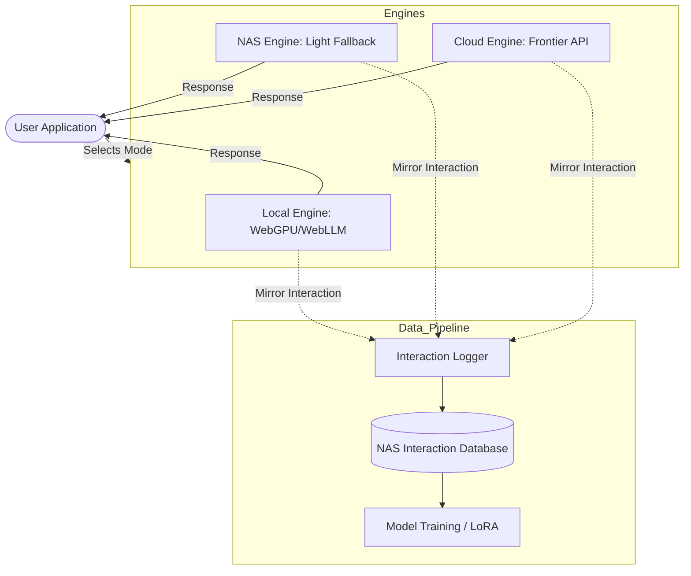
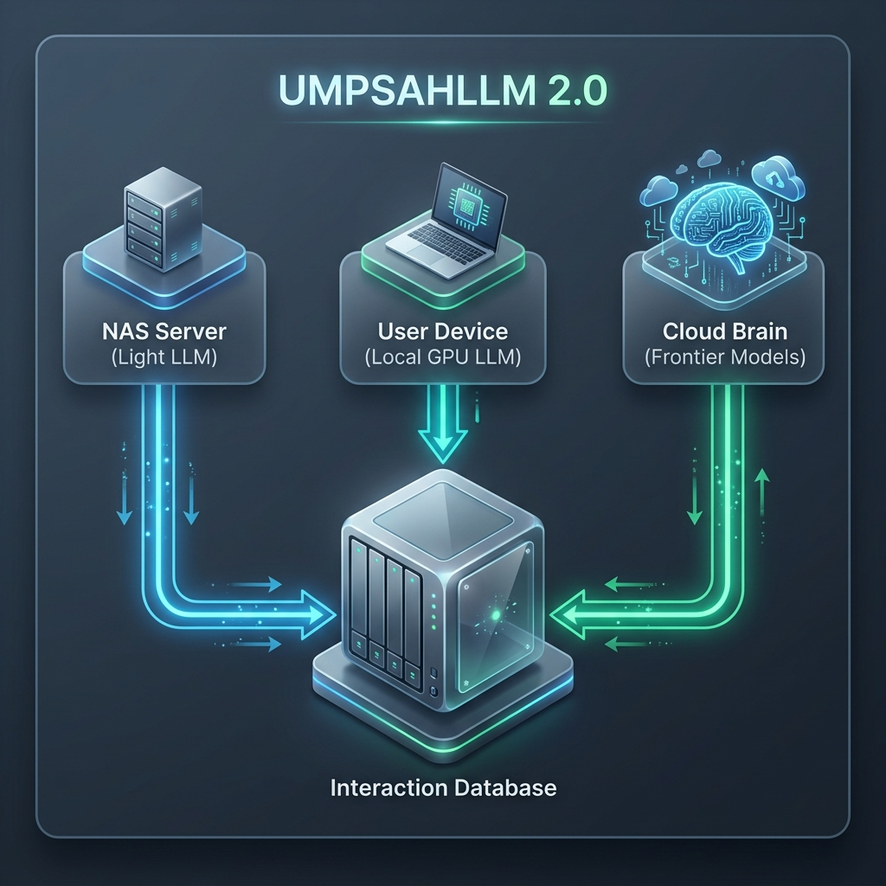

# UMPSAHLLM 2.0: System Architecture

The following diagram illustrates the **Tri-Engine Hybrid Flow**. This design maximizes performance by utilizing local hardware while ensuring all interaction data is centralized for future training.

## 📊 System Flowchart

## 🖼️ Visual Architecture Overview

---

## 🚀 Key Benefits
1. **Low Latency**: Local engine provides instant responses without server delay.
2. **Infinite Scale**: User hardware scales with the user base.
3. **Data Rich**: Every interaction contributes to the UMPSAH training set.
4. **Resiliency**: NAS and Cloud engines serve as perfect fallbacks.
