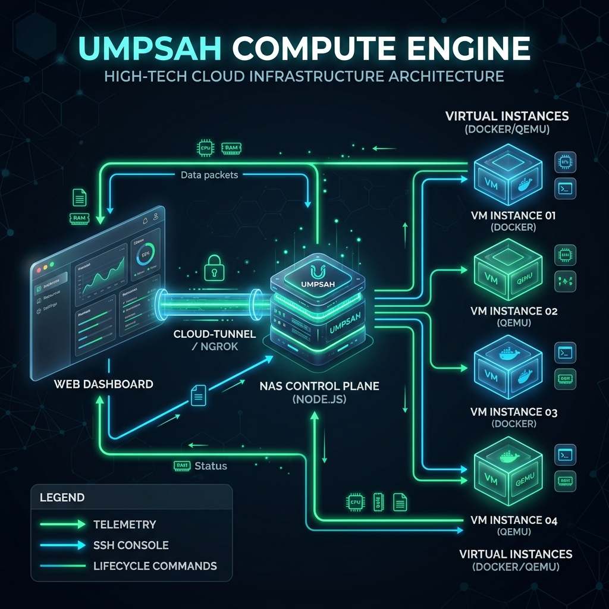

# UMPSAH Compute Engine: Architecture & Implementation Plan

To elevate the mock VPS Manager into a **fully functional Compute Engine** (similar to Google Cloud Platform's Compute Engine), we need a robust backend that interfaces directly with a hypervisor. Given that the host is a NAS, the most efficient approach is a **Container-as-a-Service (CaaS)** model using **Docker Engine**.

---

## 🏗️ 1. Core Architecture Overview

```mermaid
graph TD
    Client[Web Dashboard (React)]
    Tunnel[Cloudflare / ngrok Tunnel]
    
    subgraph NAS Server
        ControlPlane[Control Plane: Node.js API]
        Registry[(SQLite / JSON Registry)]
        
        subgraph Hypervisor [Docker Engine]
            VPS1[Instance: Node.js Env]
            VPS2[Instance: Python Worker]
            VPS3[Instance: Database]
        end
        
        Network[Traefik / Nginx Reverse Proxy]
    end

    Client <-->|HTTPS / WebSockets| Tunnel
    Tunnel <--> ControlPlane
    
    ControlPlane <-->|Docker Socket API| Hypervisor
    ControlPlane <--> Registry
    
    Network -.->|Routes Traffic to| Hypervisor
```

## 🖼️ Visual Architecture


---

## ⚙️ 2. The Tech Stack

### Frontend (The Console)
*   **React + Tailwind**: The existing UI.
*   **Xterm.js**: For embedding a real, interactive terminal/console directly in the browser.
*   **Recharts**: For rendering real-time CPU/RAM/Network telemetry graphs.
*   **Socket.io-client**: To maintain a persistent connection for logs and terminal input/output.

### Backend Control Plane (The Orchestrator)
*   **Node.js Express**: The API gateway.
*   **Dockerode**: A Node.js library to control the Docker daemon (`/var/run/docker.sock` or Windows Docker Desktop pipe). This replaces the mock JSON file.
*   **Socket.io**: To stream terminal `stdout`/`stderr` and real-time telemetry (`docker stats`) back to the frontend.
*   **node-pty**: (Optional) For creating pseudo-terminals if direct Docker exec streams are insufficient.

### Hypervisor (The Infrastructure)
*   **Docker Engine**: Runs the instances. We use containers instead of full VMs (like QEMU) because they are drastically lighter, faster to boot (milliseconds), and perfectly suited for NAS hardware.

---

## 🚀 3. Implementation Phases

### Phase 1: Infrastructure Integration (Backend)
1.  **Install Docker**: Ensure Docker is installed and running on the NAS.
2.  **Integrate Dockerode**: Update `server.js` to connect to the Docker daemon.
3.  **Real Endpoints**:
    *   `/api/vps/list`: Queries `docker ps -a` and formats it.
    *   `/api/vps/toggle`: Executes `docker start <id>` or `docker stop <id>`.

### Phase 2: Provisioning & Images (The "Create" Flow)
1.  **Image Library**: Define a set of base images (e.g., Ubuntu, Alpine Node, Python Data Science).
2.  **Resource Limits**: When creating a container, use Docker's `--cpus` and `--memory` flags to simulate instance sizing (e.g., "Micro" = 0.5 CPU, 512MB RAM).
3.  **Volume Binding**: Attach persistent storage from the NAS to the container so data survives restarts.

### Phase 3: Telemetry & Terminal (WebSockets)
1.  **Real-Time Stats**: Open a WebSocket channel. The backend runs `docker stats --stream` and emits CPU/RAM percentages to the React UI to animate the dashboard.
2.  **Web Terminal (SSH Alternative)**: 
    *   User clicks "Console" in the UI.
    *   Frontend opens Xterm.js.
    *   Backend executes `docker exec -it <id> /bin/bash`.
    *   Streams input/output via WebSocket.

### Phase 4: Networking (Public Exposure)
*   By default, instances are isolated.
*   Implement a proxy (like Traefik) or dynamic port mapping so users can expose a specific VPS port (e.g., Port 80 for a web server) to a subdomain.

---

## 🔒 4. Security Considerations
*   **Isolation**: Containers must run in unprivileged mode to prevent them from breaking out into the NAS filesystem.
*   **Authentication**: The Control Plane API must strictly verify Firebase Auth tokens before issuing any Docker commands.
*   **Tunnel Limits**: Keep the Cloudflare/ngrok tunnel locked down; only the Node.js API should be exposed, NEVER the Docker daemon directly.
